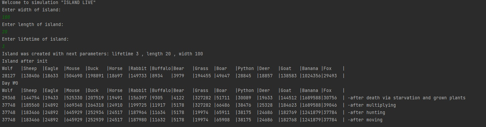
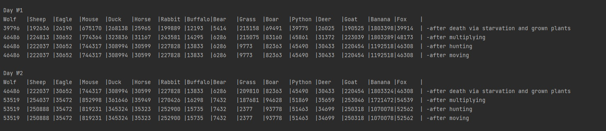

# Ivan_Didenko_Javarush_Project2

# Island
____
## Краткое описание

Консольное приложение Java: модель острова с изменяемыми параметрами, состоящий из массива локаций (например, 100х20 клеток). Локации будут заполнены растительностью и животными. Животные могут:

1. **есть растения и/или других животных (если в их локации есть подходящая еда)**
2. **передвигаться (в соседние локации)**
3. **размножаться (при наличии пары в их локации)**
4. **умирать от голода или быть съеденными**
____
## Реализовано:
- создана иерархия классов
- параметры острова и его сущностей (жителей) вынесены в файл параметров DB
- после старта программы запускается диалог, который позволяет менять основные параметры симуляции: размеры острова и количество дней жизни острова
- для обработки действий на острове (поедание, обновление параметров животных, размножение, возрождение растений, перемещение животных) применяется многопоточность: создаются отдельные потоки для каждой клетки острова (реализовано с помощью Phaser)
- осуществляется форматированный вывод в консоль статистики острова на протяжении всей длительности симуляции.
- Возможность настраивать характеристики животных путем изменения данных в Propeties файле DB
____
## Примеры работы программы:
После запуска симуляции:

____
